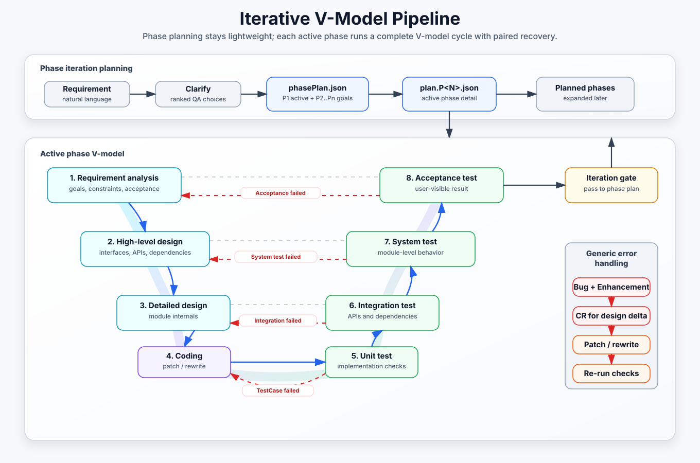
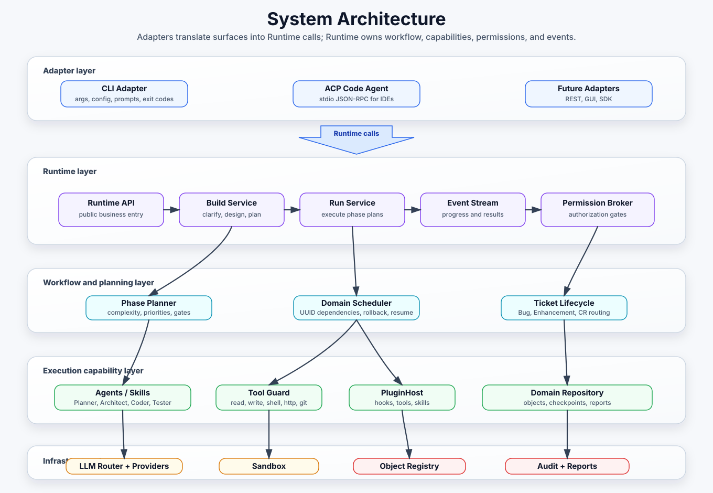

<p align="center">
  
</p>

<h1 align="center">XCompiler</h1>

<p align="center">
  <strong>AI Software Factory Runtime</strong>
</p>

> Turn natural-language requirements into runnable, tested Python or TypeScript projects through an iterative V-model workflow.

<p align="center">
  <a href="https://www.npmjs.com/package/@xcompiler/cli"></a>
  <a href="LICENSE"></a>
  <a href="https://nodejs.org">= 24" /></a>
</p>

Languages: **EN** (default) · [简体中文](README.CN.md)

---

## What XCompiler Does

XCompiler is a reusable AI software factory runtime. It compiles a product request into an executable engineering plan, then runs that plan with sandboxed agents, guarded tools, tests, debug loops, audit logs, and resumable project state.

| Command | Role | Input | Output |
|---|---|---|---|
| `xcompiler build` | Compile requirements into a `phasePlan.json` plus the current phase plan, such as `plan.P1.json` | Requirement text (`-i req.md`, `-t topic.md`, or interactive input) | `topic.md`, `phasePlan.json`, `plan.P1.json`, `plan.md`, `<name>.xc` |
| `xcompiler run` | Execute the current phase through the V-model workflow | `phasePlan.json` | Runnable project, tests, docs, audit trail, updated progress |
| `xcompiler load` | Resume from a project file | `<name>.xc` | Continue the saved phase/task state |
| `xcompiler append` / `xcompiler evolve` | Add new requirements to an existing project | Existing workspace/project file plus new requirement | Incremental plan and implementation |
| `xcompiler acp` | Run as an ACP code-agent adapter | stdio JSON-RPC from an IDE/editor | Runtime-backed code-agent events and results |

The current architecture treats **Runtime as the only business entry point**. CLI and ACP are adapters: they parse input, load config, render output, and listen to Runtime events, while Runtime owns build/run/workflow/agent/tool/plugin/memory behavior.

---

## Iterative V-Model Pipeline

XCompiler combines a phase iteration model with the V-model. The planner first creates a high-level `phasePlan.json`, then expands only the active phase into a concrete `plan.P<N>.json`. Each current phase runs a full V-model cycle. After its iteration gate and project audit pass, it becomes `complete`; XCompiler activates the first dependency-ready phase and materializes only that phase's plan for the next run.

<p align="center">
  
</p>

V-model behavior:

- `REQUIREMENT_ANALYSIS`, `HIGH_LEVEL_DESIGN`, `DETAILED_DESIGN`, and `CODE` each generate the paired test plan and executable test cases: functional, module/contract, integration, and unit respectively.
- `HIGH_LEVEL_DESIGN` defines system-level interfaces, external APIs, third-party libraries, and dependencies.
- `DETAILED_DESIGN` defines internal module structure and implementation details.
- `UNIT_TEST`, `INTEGRATION_TEST`, `MODULE_TEST`, and `FUNCTIONAL_TEST` are validation-only: they inspect the existing paired tests, run the scoped gate, and write reports without modifying `src/` or `tests/`.
- Every S1-S4 delivery gate records stage completion and alignment with its upstream requirement/design contract. Missing or under-aligned work opens an `enhance` Ticket and reruns the owning stage in incremental mode.
- S5 enforces line, branch, and test-case pass coverage; S6 enforces interface and integration-scenario coverage; S7 enforces module and contract coverage; S8 enforces functional, requirement, and end-to-end coverage. Each plan can override thresholds and bounded `tolerance`.
- A metric shortfall, skipped-test excess, warning excess, or missing quality evidence opens an `enhance`; an actual failed test, command error, or semantic `validationDefect` opens a `bug`.
- Runtime compiles every executable iteration into one `epic`, eight `kind: v-model-stage` Features, and one final `kind: delivery` Feature. A Step's first and second `subTasks` levels become Task and Sub-task Tickets.
- Stage Features carry explicit `dependsOnTicketIds`; V-model source/verification pairs use `verificationTicketId` and `pairedSourceTicketId`. Array order is never treated as a dependency.
- A later iteration Epic explicitly depends on its prerequisite Epics, and its first stage Feature inherits that gate. Reordering Plan arrays cannot bypass an unfinished iteration.
- Stage identity is the composite `(iterationId, stepId)`, so P1/S001 and P2/S001 have separate Features, blockers, retries, and Debug histories.
- The delivery Feature starts only after all eight stage Features are both `closed` and execution-`passed`, prerequisite Epics have passed, and no active Bug, Enhance, or Change Request remains. Closing it closes the Epic; it never cascades fake completion into unfinished children.
- A concrete failure creates a `bug` for Debugger execution. Quality findings are independent `enhance` Tickets with kind `defect`, `functional-gap`, or `test-incomplete`; they are not disguised as Bugs.
- Only an accepted upstream design/contract delta creates a `change-request`. Its trigger is the Enhance finding; `originBugTicketId` is present only when a Bug initiated that finding. Downstream stages apply only the delta and record change/verification commits.
- A downstream failure creates another linked Bug and increments the same change-request revision. A child change-request is created only when the correction materially expands contract or scope.
- Bug closure order is fixed: repair -> verification -> debug-wiki persistence -> `closed`. A design Bug remains blocked by its change-request until every affected gate passes.
- Completed-phase debug must provide a real patch/rewrite or successful verification evidence.
- Network/API failures are treated as real gates: if the project API fails, the run must repair or switch API instead of hiding the failure.
- Every quality assessment is persisted in `.xcompiler/quality/assessments.json`. Successful delivery writes `docs/project-development-report.md` with iteration status, S1-S8 thresholds and measurements, tolerance observations, Ticket totals, audit results, and the final delivery verdict.

---

## System Architecture

<p align="center">
  
</p>

Layer responsibilities:

- **Adapters**: argument/protocol parsing, config loading, user interaction, output rendering, exit codes.
- **Runtime**: Runtime API, Build Service, Run Service, Event Stream, and Permission Broker; the only business entry point.
- **Workflow and planning**: phase iteration, V-model definition, Ticket-graph compilation/routing, rollback, iteration gates, delivery, resume.
- **State policy**: the Ticket graph is the runtime source of truth for `epic`, `feature`, `task`, `sub-task`, `bug`, `enhance`, and `change-request`. Plan Step status/retry fields are progress projections only. No adapter or agent mutates persisted workflow state directly.
- **Agents / Skills**: role-specific prompts plus allowed tools for each stage.
- **Tools**: guarded file edits, program/test execution, API fetches, dependency edits, git snapshots.
- **LLM Router**: role chains, provider scores, cluster fallbacks, OpenAI-compatible/Ollama clients, audit.
- **Workspace**: `phasePlan.json`, `plan.P<N>.json`, `<name>.xc`, `.xcompiler/audit.jsonl`, `.xcompiler/tickets/`, `.xcompiler/quality/assessments.json`, debug cache, project memory, and `docs/project-development-report.md`.

Ticket state is persisted in `.xcompiler/tickets/index.json`, per-ticket JSON/Markdown snapshots, and the append-only `.xcompiler/tickets/events.jsonl`. Work Tickets separate governance status from execution state (`queued`, `running`, `passed`, `failed`). Bug evidence and repair patches live under the Bug Ticket directory, so every handoff keeps its trigger, root Epic, dependencies, V-model pairing, blockers, affected artifacts, acceptance gates, and final resolution.
`.xcompiler/tickets/summary.json` separates enhancement kinds, CR revisions, status counts, and per-provider model impact. A quality gap penalizes the attributed author provider; a validated finding rewards its validator; verified Debug and CR work rewards the providers that produced the accepted repair. Creating a CR by itself never changes a model score.

---

## Install From npm

```bash
npm install -g @xcompiler/cli
mkdir xcompiler-demo && cd xcompiler-demo
cp "$(npm root -g)/@xcompiler/cli/config.example.yaml" config.yaml
cp "$(npm root -g)/@xcompiler/cli/.env.example" .env
# Edit .env and set OPENROUTER_API_KEY
xcompiler doctor
```

The default template uses OpenRouter Free mode through a `type: openai` OpenAI-compatible provider:

```yaml
model: openrouter/free
base_url: https://openrouter.ai/api/v1
context_window: 128K
```

`config.yaml`, `llm_scores.yaml`, and `llm_scores_user.yaml` are local files and are intentionally not committed. The npm package ships `config.example.yaml` and `.env.example` as templates. `llm_scores.yaml` is XCompiler-maintained runtime state; create `llm_scores_user.yaml` only when you want fixed local score overrides such as `provider: 0` to disable one provider.

---

## Quick Start

```bash
echo "Parse a DBC file into an Excel report" > req.md
xcompiler build -i req.md --yes
xcompiler run /tmp/xcompiler-<timestamp>/phasePlan.json
xcompiler load /tmp/xcompiler-<timestamp>/xcompiler-<timestamp>.xc
```

Source checkout development:

```bash
npm ci
cp .env.example .env
cp config.example.yaml config.yaml
npm run build
npm link
xcompiler --help
```

Dev mode without linking:

```bash
npm run dev -- build -i req.md --yes
npm run dev -- run path/to/phasePlan.json
```

Incremental development:

```bash
xcompiler build -w path/to/workspace -i feature_req.md --intent feature --yes
xcompiler evolve -w path/to/workspace -i refactor_req.md --intent refactor --yes
xcompiler append path/to/workspace/<name>.xc -i feature_req.md --yes
```

Self-bootstrap:

```bash
xcompiler bootstrap -r path/to/XCompiler -i self_req.md --yes
```

---

## Common Commands

| Command | Purpose |
|---|---|
| `xcompiler build -i <file>` | Build a phase plan from a requirement file |
| `xcompiler build -t <topic.md>` | Reuse a clarified topic and skip Gate 1 |
| `xcompiler run <phasePlan.json>` | Execute the active phase plan |
| `xcompiler run --from <stepId>` | Resume from a specific step |
| `xcompiler run --phase <phase>` | Run only one phase/stage |
| `xcompiler run --debug-wiki-path <dir>` | Reuse and update a shared layered debug wiki path |
| `xcompiler load <name.xc>` | Load project config/progress and continue |
| `xcompiler append <name.xc> -i <file>` | Add a new requirement to an existing project |
| `xcompiler evolve -w <workspace> -i <file>` | Build and run an incremental change |
| `xcompiler acp` | Start the ACP code-agent stdio adapter |
| `xcompiler doctor` | Check config, LLM providers, sandbox, and skills |
| `xcompiler ls` / `xcompiler show <stepId>` | Inspect plans and recent audit entries |
| `npm run release:local -- vX.Y.Z` | Prepare a local release commit and tag without pushing |

---

## Runtime Defaults

- **LLM**: OpenRouter Free mode by default. Missing/invalid keys produce provider/model/base URL/status/body diagnostics and an explicit `OPENROUTER_API_KEY` hint.
- **LLM routing**: role-specific provider chains, XCompiler-maintained dynamic scores, user overrides from `llm_scores_user.yaml`, and `tags: [cluster]` fallback score bands for aggregated routes such as `openrouter/free`.
- **Languages**: Python and TypeScript project generation, testing, execution, and entry checks.
- **Sandbox**: `subprocess` by default with an isolated environment (`inherit_env: false`); optional `docker` mode for enforceable network/resource isolation. `network: off` is rejected in subprocess mode because a host child process cannot enforce it.
- **Audit**: every run writes `.xcompiler/audit.jsonl`, LLM stream traces, `docs/process_log.md`, debug cache, debug wiki feedback, and project memory.
- **Debug wiki**: Bug Ticket repairs retrieve LLM-wiki style prior fixes by compact `DebugBrief`. The wiki is a layered Markdown knowledge base: bundled `wiki/system` policy pages, bundled `wiki/agent` calibration pages, and local `wiki/external` resolved-Bug knowledge. Runtime regenerates `index.md` for review, `index.json` for retrieval, and `log.md` for append-only operations. By default it is copied to the XCompiler path (`$XC_PATH/.xcompiler/debug-wiki` when `XC_PATH` is set, otherwise the package/repo root); use `--debug-wiki-path <dir>` to share a different root. A Bug closes only after its `bugResolutionPlan` and evidence are persisted; failed reused fixes are marked `needs_review`.
- **Security gates**: project file access is guarded, write tools are scoped to declared outputs, and sensitive actions can be surfaced as permission events in adapter scenarios.

---

## Runtime Tuning

LLM routing is configured under `config.yaml -> llm.*`.

| Field | Default | Effect |
|---|---|---|
| `roles.<Role>` | role dependent | Ordered/scored provider chain for Planner, Architect, Coder, Tester, Debugger |
| `providers.<name>.context_window` | `128K` | Model input+output context capacity; accepts token counts such as `131072`, `128K`, or an empty value for the default |
| `llm_scores_user.yaml` | absent | Local user score overrides; `0` disables, `0.1..1` fixes effective priority |
| `cluster_score_min/max` | `0.2..0.5` | Dynamic score band for providers tagged `cluster`; user overrides may still use `0.1..1` |
| `agent.sandboxes.python.mode` | `subprocess` | Python project sandbox backend: local subprocess or Docker |
| `agent.sandboxes.typescript.mode` | `subprocess` | TypeScript project sandbox backend: local subprocess or Docker |
| `agent.sandboxes.<language>.local.inherit_env` | `false` | Opt in to host environment inheritance; keep false when the host contains API keys or other secrets |
| `max_rounds_per_step` | `6` | LLM dialogue limit within a normal step |
| `max_debug_rounds_per_step` | `max(8, 2 * max_rounds_per_step)` | Debugger round cap |
| `max_debug_retries` | `3` | Debug retry attempts |
| `--debug-wiki-path <dir>` | XCompiler path `.xcompiler/debug-wiki` | Shared layered debug wiki root |
| `max_edit_lines_per_step` | `auto` | Adaptive EditGuard cumulative write-line budget |
| `max_write_chunk_bytes` | `auto` | Per-call write budget derived from the active Provider context window and current prompt; a number remains a hard override |
| `agent.sandboxes.<language>.<local\|docker>.limits.network` | `download-only` | Docker supports enforceable `off`; subprocess rejects `off` instead of claiming isolation it cannot provide |

---

## Documentation

| Path | Content |
|---|---|
| [docs/openrouter.md](docs/openrouter.md) | OpenRouter Free-mode setup and OpenAI-compatible provider notes |
| [docs/acp.md](docs/acp.md) | ACP code-agent adapter protocol notes |
| [docs/XCompiler_design.md](docs/XCompiler_design.md) | Core design and V-model concepts |
| [docs/plugin_api.md](docs/plugin_api.md) | Plugin API, lifecycle hooks, tools, skills |
| [docs/versioning.md](docs/versioning.md) | Version sources, release script, tag policy |
| [docs/self_bootstrap.md](docs/self_bootstrap.md) | Self-bootstrap and qualification gates |
| [docs/deploy.md](docs/deploy.md) | Local, Docker, and native package deployment |

---

## Tests

```bash
npm run version:check
npm run typecheck
npm run lint
npm test
npm run build
```

Recent local release gate: 60 test files / 616 tests passed.

---

## License

[Apache License 2.0](LICENSE) © 2026 The XCompiler Authors. See [NOTICE](NOTICE) for details.
